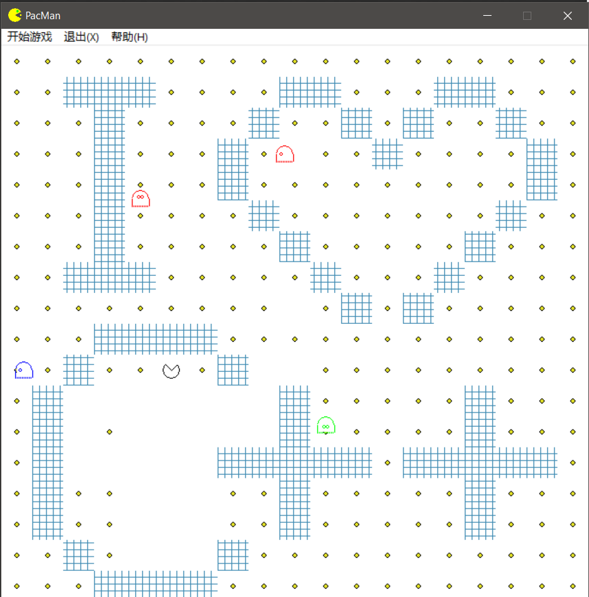
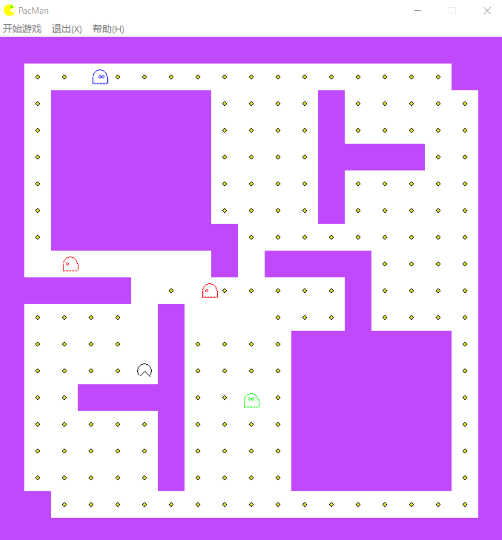

# Pacman_Game
__C++大作业__

在此做个说明，其实大学里能用C++做一个项目的次数不多，通过大作业练习C++还是比较重要的，通常做c++大作业应该是在暑假吧，其实更推荐去用c++实现各种数据结构，这样之后的数据结构也能更好的学习。如是刷题党的话请忽略。刚开始编程就接触C++其实还是比较困难的，尤其是你还想搞个界面出来。相比较其实python和java要好很多。我是在vs下面开发的，其实还是建议用文本编辑器写代码吧，这样对初学者而言记得也更加牢靠一些。

__这个小游戏用了哪些东西？__

0. C++的基本语法使用

1. 类，面向对象的使用。地图，角色都是类封装的，有一点点面向对象的思想
2. Win32 GDI图形界面编程（这个还是别学了，头秃）
3. 基本数据结构：栈和队列的使用
4. 简易版A*算法 （一种寻路算法，于此同时可以了解一下BFS和DFS）

__使用__

可执行文件: PacMan.exe 需要和资源文件放在同一路径下

save.dat是关卡进度文件，是二进制保存的

stage.dat是地图资源文件，可以自己编辑地图来创建新的地图 ，文本编辑即可

- B代表墙
- A代表豆子

__问题__

1. 游戏界面可以修改
2. 寻路的算法是按照时间进行刷新的，会导致一些问题比如敌人会反复在一块地方移动，以及内存的浪费。

__运行__

